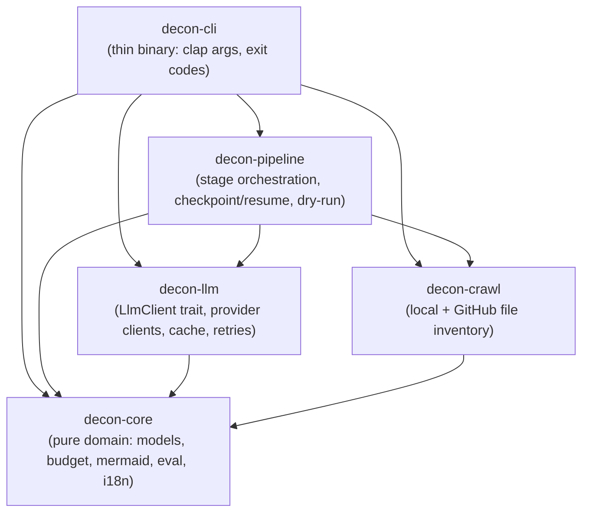
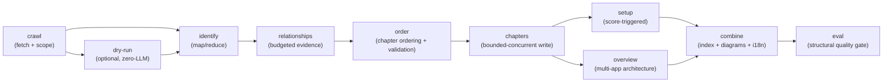
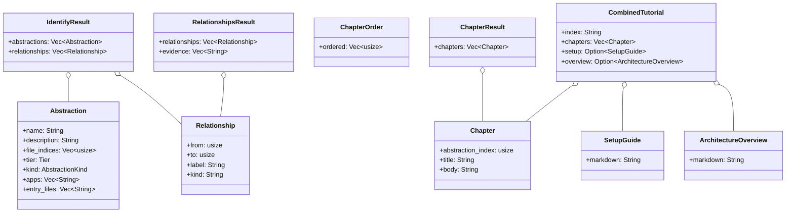

# Architecture

This document describes the crate-level structure, data flow, and key types of
`decon`. It is the contributor-facing companion to the user-facing
[`README.md`](README.md) and the migration design in
[`docs/move-to-rust.md`](docs/move-to-rust.md). Architectural decisions are
recorded in [`docs/adr/`](docs/adr/) and referenced where relevant below.

---

## Crate dependency hierarchy

`decon` is a Cargo workspace of five crates. Dependencies flow strictly
downward: the CLI binary depends on the pipeline; the pipeline depends on the
LLM client, the crawler, and core; core has no workspace dependencies and stays
pure for easy unit testing.



The layering rule: **library crates perform no CLI or main-binary logic**.
`decon-cli` is a thin wrapper that parses arguments, wires the pipeline, and
maps errors to exit codes. Public APIs in library crates carry rustdoc
(`#![deny(missing_docs)]`).

### Workspace layout

```
decon-rs/
├── crates/
│   ├── decon-core/       # Pure domain models, traits, budgeting, mermaid sanitize
│   ├── decon-crawl/      # Local + GitHub crawling (gitignore-aware, symlink-safe)
│   ├── decon-llm/        # LlmClient trait, provider clients, disk cache, retries
│   ├── decon-pipeline/   # Stage orchestration, checkpoint/resume, dry-run, benchmarks
│   └── decon-cli/        # Thin binary — clap args, completions, man page, exit codes
│   (decon-mcp/)          # MCP server — proposed (ADR 0015), post-v1.0.0
├── prompts/              # 10 versioned Jinja2 templates (identify, relationships, chapters, …)
├── tests/fixtures/       # Minimal repos + frozen baseline.json + Rust regenerator
├── docs/
│   ├── move-to-rust.md   # Migration design: pipeline model, domain objects, phase plan
│   ├── best-practices.md # Language-agnostic product rules (scope, budget, quality, mermaid)
│   └── adr/              # Architecture Decision Records (0001–0014)
├── homebrew/             # Homebrew formula template (decon.rb)
├── .github/workflows/    # CI (fmt/clippy/test/cov/doc/audit/baseline) + release + rs-guard review
└── CONTRIBUTING.md       # TDD workflow, coverage gate, check commands
```

---

## Design principles

The architecture follows four principles that guide every stage and module
boundary:

### 1. I/O isolation

All filesystem, network, and subprocess I/O lives at the edges —
`decon-crawl` (filesystem walk, `git` shell-out), `decon-llm` (HTTP provider
calls, disk cache), and `decon-cli` (argument parsing, exit codes). The
pipeline orchestration (`decon-pipeline`) coordinates stages but delegates
I/O to these crates. `decon-core` is **pure**: no network, no filesystem,
no `tokio`. This keeps the domain logic fast, deterministic, and easy to
unit-test without mocks.

### 2. Fail-closed budgeting

The `max_llm_calls` budget (`decon-core::progress`) is enforced
**fail-closed**: if the tracker cannot confirm remaining budget, the stage
aborts rather than exceeding the limit. This prevents runaway costs on large
monorepos and surfaces budget exhaustion as a distinct exit code (3) instead
of a silent hang. The same principle applies to the context budget
(`decon-core::budget`) — per-file truncation and per-batch char budgets are
hard limits, not suggestions.

### 3. Checkpoint-first

Every expensive stage writes its output to the checkpoint **before** the
stage is marked complete. On resume, each stage checks `completed_stages`
and skips if already done. Stage outputs are stored as files with SHA-256
verification (ADR 0006) so corruption is detected, not silently propagated.
Ctrl+C triggers a graceful shutdown that dumps a clean checkpoint (exit 5),
so the next run resumes from the last completed stage — never from a
half-written state.

### 4. Pure core

Domain types (`Abstraction`, `Relationship`, `Chapter`, `RunConfig`,
`CheckpointV1`, …) and all pure logic (budgeting, scope filtering, mermaid
sanitize, eval scoring, kind detection heuristics) live in `decon-core`.
Stages in `decon-pipeline` are thin orchestrators that call into core for
the actual work. This separation means the hard IP — quality rules,
monorepo heuristics, prompt contracts — is testable without any I/O and
reusable by future front-ends (a hosted mode, an editor plugin) without
dragging in the CLI.

---

## Pipeline data flow

The full `decon generate` pipeline runs a linear sequence of stages. Every
expensive stage is idempotent and checkpointed so a long monorepo run can
resume after failure. The `dry-run` stage is zero-LLM and optional; it produces
a machine-readable plan for CI and agents.



`setup` and `overview` are conditional: the setup guide is generated only when
the README/config setup score is weak; the architecture overview is generated
only for multi-app (monorepo) systems. With `--each-app`, the pipeline fans out
and runs the stages per app, then combines per-app tutorials.

### Stage ordering and resume

Stages are tracked by the `StageId` enum (`fetch`, `dry_run`, `identify`,
`relationships`, `order`, `chapters`, `setup`, `overview`, `combine`, `eval`).
On resume, each stage checks the checkpoint for completion and skips if already
done, enabling resume from any point without re-running expensive LLM calls.

---

## Module responsibilities

| Crate | Module | Responsibility |
|-------|--------|----------------|
| `decon-core` | `module` | Module keys and inventory discovery (pure) |
| `decon-core` | `scope` | Monorepo `--apps` / `--exclude-apps` filter (pure) |
| `decon-core` | `setup` | Setup assessment scoring from five README signals (pure) |
| `decon-core` | `budget` | Context budget: per-file truncate, per-batch char budget (pure) |
| `decon-core` | `mermaid` | Mermaid sanitize and light validate (pure) |
| `decon-core` | `diagrams` | Deterministic index diagram builders (always sanitize/validate) |
| `decon-core` | `eval` | Structural tutorial quality gate (fixtures under `tests/fixtures/tutorials/`) |
| `decon-core` | `config` | `RunConfig` layering: CLI > file > env > defaults |
| `decon-core` | `checkpoint` | Checkpoint schema v1 types (ADR 0001 metadata; ADR 0006 stage outputs) |
| `decon-core` | `progress` | Progress tracker and max-LLM-calls budget (fail-closed) |
| `decon-core` | `secrets` | Secrets path classification and content redaction |
| `decon-core` | `i18n` | `Locale` + `ChromeStrings` (en/es); ADR 0007 |
| `decon-core` | `chapter` | `Chapter`, `ChapterOrder`, `ChapterResult` domain types |
| `decon-core` | `abstraction` | `Abstraction`, `Relationship`, `IdentifyResult`, `RelationshipsResult` |
| `decon-core` | `generate` | `SetupGuide`, `ArchitectureOverview`, `CombinedTutorial` |
| `decon-core` | `extract` | Robust YAML/JSON block extraction from messy LLM output |
| `decon-core` | `stage_output` | `StageOutput<T>` JSON envelope and per-stage output types (ADR 0012) |
| `decon-core` | `plugin` | `KindDetector` trait, `PluginRegistry`, `DefaultKindDetector` (ADR 0014) |
| `decon-crawl` | `local` | Local filesystem inventory (gitignore-aware, `ignore` walker, symlink cycle detection) |
| `decon-crawl` | `git_diff` | Git-diff incremental file detection via `git` shell-out; `--since` support (ADR 0013) |
| `decon-llm` | `client` | `LlmClient` async trait (ADR 0002) |
| `decon-llm` | `mock` | `MockClient` test double |
| `decon-llm` | `openai_client` | OpenAI-compatible HTTP client with retry/backoff/timeout |
| `decon-llm` | `cache` | Disk response cache keyed by hash(prompt)+model+provider; enabled by default with LRU eviction (ADR 0009) |
| `decon-llm` | `concurrency` | Bounded-concurrency map batches via `tokio::sync::Semaphore` (ADR 0003) |
| `decon-pipeline` | `dry_run` | Dry-run plan assembly with baseline parity |
| `decon-pipeline` | `identify` | Map/reduce + single-shot identify stages |
| `decon-pipeline` | `identify_checkpoint` | Checkpoint-after-identify and resume |
| `decon-pipeline` | `relationships` | Budgeted evidence selection |
| `decon-pipeline` | `order` | Chapter ordering + validation |
| `decon-pipeline` | `chapters` | Bounded-concurrent chapter writing |
| `decon-pipeline` | `setup_guide` | Score-triggered setup guide generation |
| `decon-pipeline` | `overview` | Multi-app architecture overview |
| `decon-pipeline` | `combine` | Index + diagrams + i18n chrome + sanitize |
| `decon-pipeline` | `review` | `--review-chapters` second LLM pass per chapter |
| `decon-pipeline` | `generate` | Full pipeline orchestration + `--each-app` fan-out |
| `decon-pipeline` | `checkpoint_store` | Save/load bundle; file-based stage outputs (ADR 0006) |
| `decon-pipeline` | `resume` | Stage-skip / invalidate helpers |
| `decon-pipeline` | `prompts` | `minijinja` prompt rendering |
| `decon-pipeline` | `cancellation` | Ctrl+C / SIGTERM graceful shutdown (exit 5) |
| `decon-cli` | `main` | Clap argument parsing, pipeline wiring, exit codes |

---

## Key types and relationships

The pipeline passes domain objects between stages. All types live in
`decon-core` so library crates stay testable without network or filesystem
dependencies.



| Type | Crate / module | Produced by | Consumed by |
|------|----------------|-------------|-------------|
| `Abstraction` | `decon-core::abstraction` | identify (map/reduce) | relationships, order, chapters |
| `Relationship` | `decon-core::abstraction` | identify, relationships | combine (index diagrams) |
| `IdentifyResult` | `decon-core::abstraction` | identify stage | relationships, order, chapters |
| `RelationshipsResult` | `decon-core::abstraction` | relationships stage | order, combine |
| `ChapterOrder` | `decon-core::chapter` | order stage | chapters |
| `Chapter` | `decon-core::chapter` | chapters stage | combine |
| `ChapterResult` | `decon-core::chapter` | chapters stage | combine, review |
| `SetupGuide` | `decon-core::generate` | setup stage (score-triggered) | combine |
| `ArchitectureOverview` | `decon-core::generate` | overview stage (multi-app) | combine |
| `CombinedTutorial` | `decon-core::generate` | combine stage | eval, output write |
| `RunConfig` | `decon-core::config` | CLI / file / env layering | every stage |
| `CheckpointV1` | `decon-core::checkpoint` | checkpoint store | resume, every stage |

---

## Checkpoint and resume architecture

Long monorepo runs can require dozens of LLM calls. Every expensive stage is
idempotent and checkpointed so the pipeline can resume after failure or
Ctrl+C interruption.

### Format (ADR 0001)

The checkpoint is split into a small metadata file and a compressed sidecar:

- `checkpoint.json` — versioned metadata: `completed_stages`, `config`,
  `abstractions`, `relationships`, and a manifest pointer.
- `files.ndjson.gz` — the crawled file corpus as content-addressed records,
  kept out of the metadata file so storage and memory stay bounded as the
  repository grows.

Storing full file bodies inside one giant JSON checkpoint does not scale; the
split design avoids the I/O bottleneck the Python reference suffered from. See
[ADR 0001](docs/adr/0001-checkpoint-schema-v1.md).

### File-based stage output storage (ADR 0006)

M4 stages produce large Markdown documents (one chapter file per abstraction,
a setup guide, an architecture overview, a combined index). Storing these as
inline JSON strings inside `checkpoint.json` would recreate the original
problem ADR 0001 solved for file bodies. Instead, stage outputs are written as
files alongside the checkpoint with SHA-256 verification, so the metadata file
stays small and stage save/load remains fast. See
[ADR 0006](docs/adr/0006-file-based-checkpoint-output-storage.md).

### Resume behavior

On resume, each stage checks `completed_stages` in the checkpoint and skips if
already done. The `resume` module provides stage-skip and partial-regenerate
helpers. `decon resume --checkpoint PATH` reports the next pending stage
without re-running anything. Ctrl+C triggers a graceful shutdown
(`cancellation` module) that dumps a clean checkpoint and exits with code 5,
so the next run resumes from the last completed stage.

---

## Architectural decisions

Architectural decisions are recorded as ADRs in [`docs/adr/`](docs/adr/).

| ADR | Decision |
|-----|----------|
| [0001](docs/adr/0001-checkpoint-schema-v1.md) | Content-addressed checkpoint format for resume |
| [0002](docs/adr/0002-async-trait-llm-client.md) | `async-trait` for the `LlmClient` trait (object-safety tradeoff) |
| [0003](docs/adr/0003-bounded-concurrency-semaphore.md) | `tokio::sync::Semaphore` for bounded map batches |
| [0004](docs/adr/0004-yaml-parser-migration.md) | Migration off unsound `serde_yml`/`libyml` (superseded by 0005) |
| [0005](docs/adr/0005-yaml-parser-serde-yaml-ng.md) | Migration to the maintained `serde_yaml_ng` fork |
| [0006](docs/adr/0006-file-based-checkpoint-output-storage.md) | File-based stage output storage with SHA-256 verification |
| [0007](docs/adr/0007-i18n-chrome-design.md) | Generic localization framework for tutorial chrome strings |
| [0008](docs/adr/0008-two-tier-golden-fixture-strategy.md) | Two-tier golden fixture strategy for eval regression |
| [0009](docs/adr/0009-disk-cache-default-lru-eviction.md) | Disk cache enabled by default with LRU eviction and size limits |
| [0010](docs/adr/0010-release-strategy.md) | Release strategy: GitHub Releases, Homebrew, cargo install, cargo-binstall |
| [0011](docs/adr/0011-python-deprecation-approach.md) | Python deprecation: migration guide over wrapper (Option B) |
| [0012](docs/adr/0012-json-output-schema.md) | JSON output schema for pipeline stages (`StageOutput<T>` envelope) |
| [0013](docs/adr/0013-git-diff-incremental.md) | Git-diff incremental file detection (`--since`) |
| [0014](docs/adr/0014-plugin-architecture.md) | Plugin trait and registry for custom kind detectors |
| [0015](docs/adr/0015-mcp-server.md) | MCP server for codebase knowledge querying (proposed, post-v1.0.0) |

---

## Related documentation

- [`README.md`](README.md) — project overview, quick start, CLI at a glance
- [`docs/usage-guide.md`](docs/usage-guide.md) — every command, flag, env var,
  provider setup, examples
- [`docs/troubleshooting.md`](docs/troubleshooting.md) — exit codes, recovery,
  common issues
- [`docs/project-status.md`](docs/project-status.md) — milestones, what works,
  roadmap
- [`docs/move-to-rust.md`](docs/move-to-rust.md) — migration design, pipeline
  model, domain objects, phase plan, engineering bar
- [`docs/best-practices.md`](docs/best-practices.md) — language-agnostic
  product rules: scope, budget, abstraction quality, mermaid, setup docs
- [`CONTRIBUTING.md`](CONTRIBUTING.md) — TDD workflow, coverage gate, CI
  checks, PR process, commit conventions
- [`CHANGELOG.md`](CHANGELOG.md) — release history (Keep a Changelog format)
- [`prompts/README.md`](prompts/README.md) — prompt catalog and variable schema
- [`tests/fixtures/README.md`](tests/fixtures/README.md) — fixture set and
  parity strategy
