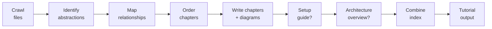
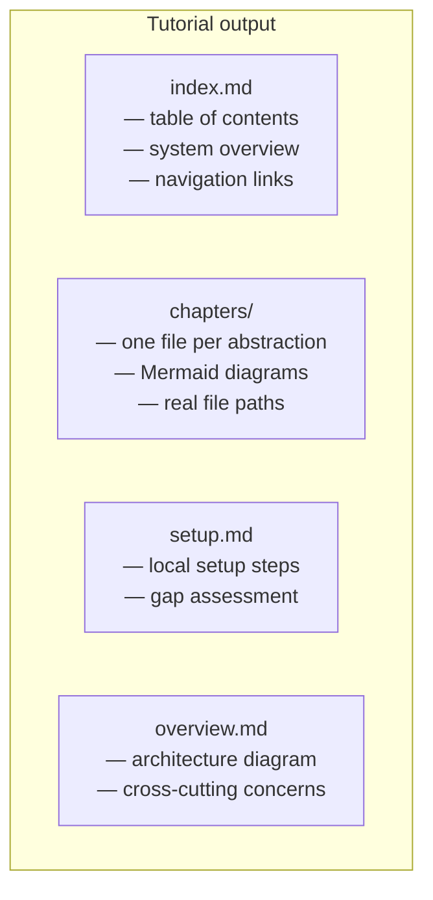

# Brigid — Rust CLI for LLM-Generated Codebase Tutorials


[](https://github.com/igmarin/brigid/actions/workflows/ci.yml)
[](https://codecov.io/gh/igmarin/brigid)
[](https://crates.io/crates/brigid-cli)
[](https://crates.io/crates/brigid-core)
[](LICENSE)

> **A memory-safe Rust CLI that turns any codebase into a beginner-friendly, LLM-generated tutorial.**

`brigid` crawls a codebase, identifies its core abstractions, and produces a
multi-chapter Markdown + Mermaid tutorial that explains how the system works:
setup, architecture, and inter-concept relationships. It is built in Rust and
designed for monorepos and large codebases where "read the source" is not a
realistic onboarding path.

**Who this is for:** teams, educators, and open-source maintainers who need onboarding tutorials generated from real code.

---

## How it works



Every expensive stage is **checkpointed** — interrupt with Ctrl+C and re-run
to resume from the last completed stage. No work is lost.

---

## Install

```bash
# Homebrew (macOS)
brew tap igmarin/homebrew-tap
brew install brigid

# cargo install
cargo install brigid-cli

# cargo-binstall (pre-built Linux binary, compiles from source on macOS/Windows)
cargo binstall brigid-cli
```

Or download the Linux binary from
[GitHub Releases](https://github.com/igmarin/brigid/releases).

Verify: `brigid --version`

---

## Quick start

```bash
# 1. Set your LLM API key (DeepSeek is the default provider)
export DEEPSEEK_API_KEY="sk-your-key-here"

# 2. Generate a tutorial from any codebase
brigid generate --dir ./my-project --output-dir ./tutorial

# 3. Open the result
open ./tutorial/index.md
```

That's it. The tutorial is plain Markdown with Mermaid diagrams — render it
in any Markdown viewer (GitHub, VS Code, Obsidian).

> **No API key?** Set `BRIGID_FORCE_MOCK=1` to run the full pipeline with a
> mock LLM client for offline testing.

---

## What you get



Each chapter references **real file paths** from your repo and includes
**Mermaid diagrams** that visualize the concept. The setup guide fills gaps
when official docs are thin. The architecture overview ties everything
together for monorepos and multi-app systems.

---

## Key features

- **Full pipeline** — crawl → identify → relationships → order → chapters →
  setup → overview → combine
- **Tutorial styles** — `--tutorial-style blog|book` (blog is default: shorter,
  conversational; book: long-form reference)
- **JSON output** — `--format json` on every stage for CI and editor plugins
- **Incremental** — `--since <git-ref>` only re-analyzes changed files and
  re-generates only chapters whose abstractions touched those files
- **Monorepo support** — `--each-app` generates one tutorial per app
- **i18n** — `--language en|es` localizes tutorial chrome
- **Chapter review** — `--review-chapters` adds a second LLM pass per chapter
- **Lenient app validation** — unknown apps warn by default;
  `--strict-app-validation` to fail hard
- **Checkpoint + resume** — interrupt and resume without losing work
- **Disk cache** — LLM responses cached on disk; re-runs are free. Inspect
  with `brigid cache stats`, clear with `brigid cache prune`
- **Plugins** — custom kind detectors via `KindDetector` trait (ADR 0014)

---

## CLI at a glance

| Command | What it does |
|---------|-------------|
| `brigid generate` | Full pipeline → tutorial |
| `brigid crawl` | File inventory (zero LLM) |
| `brigid dry-run` | Plan + budget (zero LLM) |
| `brigid eval` | Tutorial quality gate (zero LLM) |
| `brigid identify` | Single stage: abstraction identification |
| `brigid relationships` | Single stage: relationship analysis |
| `brigid order` | Single stage: chapter ordering |
| `brigid chapters` | Single stage: chapter writing |
| `brigid setup` | Single stage: setup guide |
| `brigid overview` | Single stage: architecture overview |
| `brigid combine` | Single stage: index assembly |
| `brigid init` | Write a starter `brigid.toml` |
| `brigid resume` | Checkpoint status report |
| `brigid cache stats` | Show cache entry count and on-disk size |
| `brigid cache prune` | Delete the cache file and free disk space |
| `brigid completions` | Generate shell completions |
| `brigid manpage` | Generate a man page |

For every flag, environment variable, and provider configuration, see the
[Usage Guide](docs/usage-guide.md).

---

## Configuration

`brigid init` writes a starter `brigid.toml`. Precedence is
**CLI > file > env > defaults**.

```toml
max_llm_calls = 200
max_abstractions = 30

[plugins]
dirs = ["./plugins"]
```

Run `brigid init --check` to validate an existing config.

---

## Troubleshooting

| Exit code | Meaning |
|-----------|---------|
| `0` | Success |
| `1` | Generic failure |
| `2` | Config / path / I/O error |
| `3` | Budget exhausted |
| `4` | LLM provider error |
| `5` | Cancelled — re-run to resume |

For recovery procedures, common issues, and fixes, see
[Troubleshooting](docs/troubleshooting.md).

---

## Documentation

| Document | What it covers |
|----------|---------------|
| [Usage Guide](docs/usage-guide.md) | Every command, flag, env var, provider setup, examples |
| [Troubleshooting](docs/troubleshooting.md) | Exit codes, recovery, common issues |
| [Project Status](docs/project-status.md) | Milestones, what works, roadmap |
| [Architecture](ARCHITECTURE.md) | Crate structure, data flow, design principles, ADR index |
| [Contributing](CONTRIBUTING.md) | TDD workflow, CI checks, PR process, commit conventions |
| [Changelog](CHANGELOG.md) | Release history per milestone |
| [Best Practices](docs/best-practices.md) | Tutorial quality rules (scope, budget, mermaid) |
| [Migration from Python](docs/migrating-from-python.md) | Guide for Python `brigid` users |
| [Move to Rust](docs/move-to-rust.md) | Migration design, pipeline model, phase plan |
| [ADRs](docs/adr/) | Architecture Decision Records (0001–0017) |

---

## License

MIT
