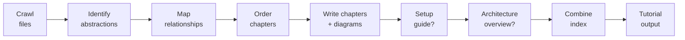
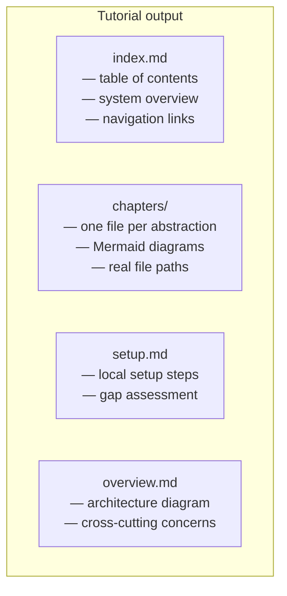

# decon-rs


[](https://github.com/igmarin/decon-rs/actions/workflows/ci.yml)
[](https://codecov.io/gh/igmarin/decon-rs)
[](https://crates.io/crates/decon-cli)
[](LICENSE)

> Turn any codebase into a beginner-friendly tutorial — powered by LLMs, built in Rust.

`decon` crawls a codebase, identifies its core abstractions, and produces a
multi-chapter Markdown + Mermaid tutorial that explains how the system works:
setup, architecture, and inter-concept relationships. Built for monorepos and
large codebases where "read the source" is not a realistic onboarding path.

---

## How it works



Every expensive stage is **checkpointed** — interrupt with Ctrl+C and re-run
to resume from the last completed stage. No work is lost.

---

## Install

```bash
# Homebrew (macOS)
brew tap igmarin/homebrew-tap
brew install decon

# cargo install
cargo install decon-cli

# cargo-binstall (pre-built binary)
cargo binstall decon-cli
```

Or download a binary from
[GitHub Releases](https://github.com/igmarin/decon-rs/releases).

Verify: `decon --version`

---

## Quick start

```bash
# 1. Set your LLM API key (DeepSeek is the default provider)
export DEEPSEEK_API_KEY="sk-your-key-here"

# 2. Generate a tutorial from any codebase
decon generate --dir ./my-project --output-dir ./tutorial

# 3. Open the result
open ./tutorial/index.md
```

That's it. The tutorial is plain Markdown with Mermaid diagrams — render it
in any Markdown viewer (GitHub, VS Code, Obsidian).

> **No API key?** Set `DECON_FORCE_MOCK=1` to run the full pipeline with a
> mock LLM client for offline testing.

---

## What you get



Each chapter references **real file paths** from your repo and includes
**Mermaid diagrams** that visualize the concept. The setup guide fills gaps
when official docs are thin. The architecture overview ties everything
together for monorepos and multi-app systems.

---

## Key features

- **Full pipeline** — crawl → identify → relationships → order → chapters →
  setup → overview → combine
- **JSON output** — `--format json` on every stage for CI and editor plugins
- **Incremental** — `--since <git-ref>` only re-analyzes changed files
- **Monorepo support** — `--each-app` generates one tutorial per app
- **i18n** — `--language en|es` localizes tutorial chrome
- **Chapter review** — `--review-chapters` adds a second LLM pass per chapter
- **Checkpoint + resume** — interrupt and resume without losing work
- **Disk cache** — LLM responses cached by default; re-runs are free
- **Plugins** — custom kind detectors via `KindDetector` trait (ADR 0014)

---

## CLI at a glance

| Command | What it does |
|---------|-------------|
| `decon generate` | Full pipeline → tutorial |
| `decon crawl` | File inventory (zero LLM) |
| `decon dry-run` | Plan + budget (zero LLM) |
| `decon eval` | Tutorial quality gate (zero LLM) |
| `decon identify` | Single stage: abstraction identification |
| `decon relationships` | Single stage: relationship analysis |
| `decon order` | Single stage: chapter ordering |
| `decon chapters` | Single stage: chapter writing |
| `decon setup` | Single stage: setup guide |
| `decon overview` | Single stage: architecture overview |
| `decon combine` | Single stage: index assembly |
| `decon init` | Write a starter `decon.toml` |
| `decon resume` | Checkpoint status report |
| `decon completions` | Generate shell completions |
| `decon manpage` | Generate a man page |

For every flag, environment variable, and provider configuration, see the
[Usage Guide](docs/usage-guide.md).

---

## Configuration

`decon init` writes a starter `decon.toml`. Precedence is
**CLI > file > env > defaults**.

```toml
max_llm_calls = 200
max_abstractions = 30

[plugins]
dirs = ["./plugins"]
```

Run `decon init --check` to validate an existing config.

---

## Troubleshooting

| Exit code | Meaning |
|-----------|---------|
| `0` | Success |
| `1` | Generic failure |
| `2` | Config / path / I/O error |
| `3` | Budget exhausted |
| `4` | LLM provider error |
| `5` | Cancelled — re-run to resume |

For recovery procedures, common issues, and fixes, see
[Troubleshooting](docs/troubleshooting.md).

---

## Documentation

| Document | What it covers |
|----------|---------------|
| [Usage Guide](docs/usage-guide.md) | Every command, flag, env var, provider setup, examples |
| [Troubleshooting](docs/troubleshooting.md) | Exit codes, recovery, common issues |
| [Project Status](docs/project-status.md) | Milestones, what works, roadmap |
| [Architecture](ARCHITECTURE.md) | Crate structure, data flow, design principles, ADR index |
| [Contributing](CONTRIBUTING.md) | TDD workflow, CI checks, PR process, commit conventions |
| [Changelog](CHANGELOG.md) | Release history per milestone |
| [Best Practices](docs/best-practices.md) | Tutorial quality rules (scope, budget, mermaid) |
| [Migration from Python](docs/migrating-from-python.md) | Guide for Python `decon` users |
| [Move to Rust](docs/move-to-rust.md) | Migration design, pipeline model, phase plan |
| [ADRs](docs/adr/) | Architecture Decision Records (0001–0016) |

---

## License

MIT
