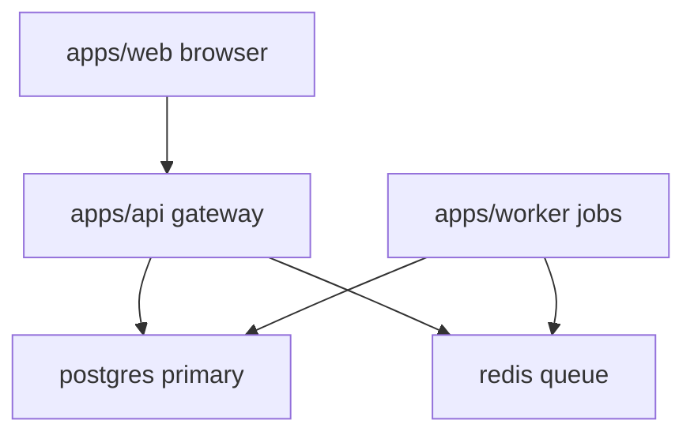

# Architecture Overview

NexusHub is a modular monolith with three deployable apps that share a single
workspace and a common library crate. This chapter describes the system type,
how the monorepo is carved up, how the apps collaborate at runtime, and the
suggested reading order for the concept chapters.

## System type

NexusHub is a distributed monorepo: one workspace, three independently
deployable apps, and a shared library. There is no microservice sprawl —
apps are split along deployment boundaries, not along every domain seam.
The api is the single entry point for external clients; the worker handles
latency-tolerant work asynchronously; the web app is a server-rendered
storefront that calls the api.

## App breakdown

The workspace is carved into four members:

- `apps/api` — REST gateway. Owns request routing, auth middleware, and
  synchronous order creation. Talks to postgres and redis.
- `apps/web` — Storefront UI. Server-rendered pages that call the api over
  HTTP. Has no direct database access.
- `apps/worker` — Async job runner. Consumes redis queues and performs
  settlement, notifications, and reconciliation against postgres.
- `lib/shared` — Core domain types shared by all three apps: money types,
  order states, and error enums.

## Collaboration diagram

The web client never touches the database directly. The api writes order
rows to postgres and enqueues a job to redis. The worker drains the queue,
settles payment, and updates order status back in postgres.

## Suggested reading order

1. [Setup](00_setup.md) — get the apps running
2. [Authentication](01_authentication.md) — how identity is established
3. [Billing](02_billing.md) — how money is recorded and settled
4. [Order Pipeline](03_order_pipeline.md) — how the pieces compose

## Key files

- `apps/api/src/router.rs` — top-level route table and middleware wiring
- `apps/web/src/server.rs` — storefront server entrypoint
- `apps/worker/src/jobs.rs` — worker job registry and dispatch loop
- `lib/shared/src/domain.rs` — shared domain types and error enums
- `Cargo.toml` — workspace member declaration

## Evidence

Grounded in the listed paths. The collaboration model matches the route
table in `apps/api/src/router.rs` and the job dispatch in
`apps/worker/src/jobs.rs`. Continue with
[Authentication](01_authentication.md).
