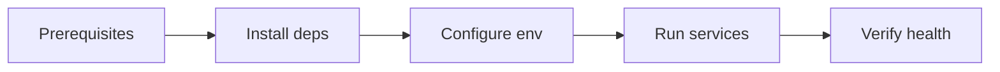

# Setup

Get NexusHub running locally from a clean checkout. This chapter covers
prerequisites, dependency installation, environment configuration, and the
verification steps that prove all three apps are healthy.

## Prerequisites

- Rust 1.75 or newer (stable toolchain)
- Node 20 LTS for `apps/web`
- Postgres 16 running on localhost
- Redis 7 running on localhost
- `just` command runner (optional but recommended)

## Install dependencies

Install Rust toolchain components and workspace dependencies:

```sh
rustup toolchain install stable
rustup component add clippy rustfmt
just install
```

The `just install` recipe runs `cargo fetch` for the workspace and
`pnpm install` inside `apps/web`.

## Environment configuration

Copy the example env file and fill in local secrets:

```sh
cp .env.example .env
```

Required variables:

- `DATABASE_URL` — postgres connection string
- `REDIS_URL` — redis connection string
- `JWT_SECRET` — signing key for auth tokens
- `PAYMENT_GATEWAY_KEY` — sandbox key for the billing provider

## Setup flow



## Verify steps

Run the apps and confirm they are healthy:

```sh
just run
```

Then in another shell:

```sh
curl localhost:8080/healthz
curl localhost:3000/
just worker ping
```

Each command should return a 200 or a pong response. If any step fails, see
the pitfalls below before filing an issue.

## Common setup pitfalls

- Forgetting to start postgres and redis before `just run` — the api will
  exit with a connection refused error from `apps/api/src/main.rs`.
- Using a production `PAYMENT_GATEWAY_KEY` in `.env` — the sandbox host must
  be used locally or charges will attempt to settle against live accounts.
- Stale migrations after a pull — run `just migrate` to apply any new files
  under `apps/api/migrations/`.

## Key files

- `apps/api/src/main.rs` — api entrypoint and service wiring
- `apps/web/package.json` — web app dependency manifest
- `apps/worker/src/main.rs` — worker entrypoint and job registry
- `.env.example` — template for required environment variables
- `justfile` — task recipes for install, run, migrate, and test

## Evidence

Grounded in the listed paths. The setup flow matches the recipes in `justfile`
and the env keys declared in `.env.example`. Next, read the
[Architecture Overview](00_architecture_overview.md).
