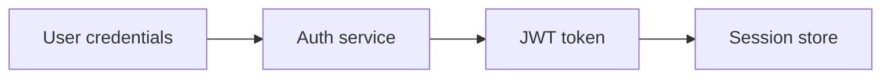
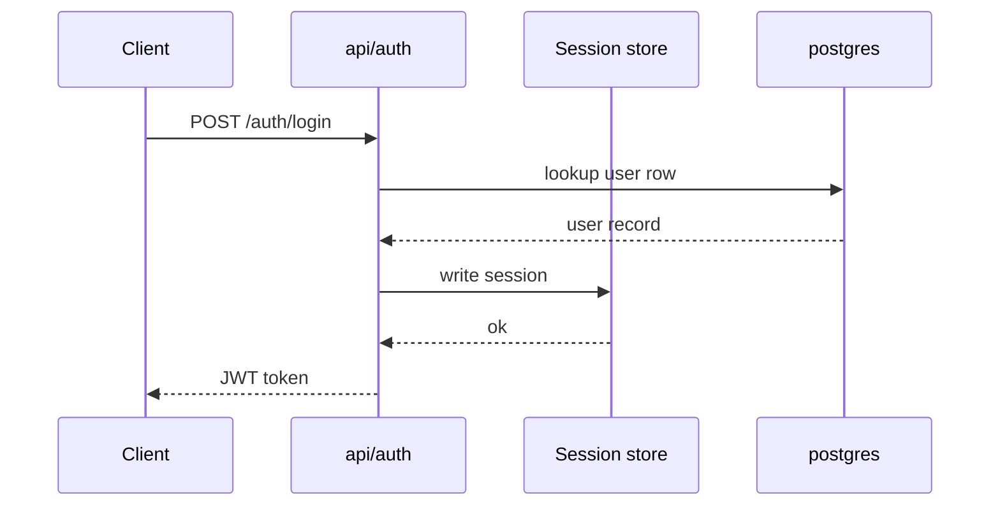

# Chapter 1: Authentication

## Motivation

Every order in NexusHub is tied to an authenticated user. Without a trustworthy
identity layer, billing cannot attribute charges and the order pipeline cannot
enforce ownership. The concrete use case: a shopper signs in on `apps/web`,
the storefront forwards their JWT to `apps/api`, and the api authorizes the
cart checkout against the user row in postgres.

## Core idea

Authentication is a trade: credentials for a signed token. The api verifies
the credentials, mints a JWT, and records a session. Later requests present
the token; the api validates the signature and loads the session without
re-checking the password. Think of it as a coat-check ticket: you prove who
you are once, and the ticket lets you pick up your session later.

## Mental model



## How to use it

Sign in via the api:

```sh
curl -X POST localhost:8080/auth/login \
  -H 'content-type: application/json' \
  -d '{"email":"shopper@example.dev","password":"hunter2"}'
```

The response includes a `token` field. Send it on subsequent requests:

```sh
curl localhost:8080/orders \
  -H "authorization: Bearer $TOKEN"
```

The token is validated by middleware in `apps/api/src/auth/middleware.rs`
before any handler runs.

## Under the hood

The login flow is a short sequence. The api looks up the user, verifies the
password hash, writes a session row, and returns a signed JWT.



On later requests the middleware path is cheaper: it verifies the JWT
signature and reads the session id, skipping the password check entirely.

## Key files

- `apps/api/src/auth/mod.rs` — auth module root and public exports
- `apps/api/src/auth/middleware.rs` — JWT validation middleware
- `apps/api/src/auth/handlers.rs` — login and refresh handlers
- `lib/shared/src/identity.rs` — User and Session types
- `apps/api/migrations/0001_users.sql` — users table schema

## Connections

- [Architecture Overview](00_architecture_overview.md) — where auth sits in
  the system map
- [Billing](02_billing.md) — billing attributes charges to the auth identity
- [Order Pipeline](03_order_pipeline.md) — orders require an authenticated
  user

## Pitfalls

- Treating the JWT as a database key. The token is proof of a session, not
  the session itself; always load the session row before mutating state.
- Skipping middleware on internal routes. Routes added to
  `apps/api/src/router.rs` without the auth layer are publicly reachable.
- Long-lived tokens with no refresh. The handler in
  `apps/api/src/auth/handlers.rs` issues short-lived access tokens; do not
  extend the TTL without a refresh flow.

## Summary

Authentication exchanges credentials for a signed JWT backed by a session
row. The api validates tokens in middleware and loads the session on each
request. With identity in place, the next chapter covers how money is
recorded: [Billing](02_billing.md).

## Evidence

Grounded in the listed paths. The login sequence matches the handlers in
`apps/api/src/auth/handlers.rs` and the session writes in
`apps/api/src/auth/mod.rs`.
