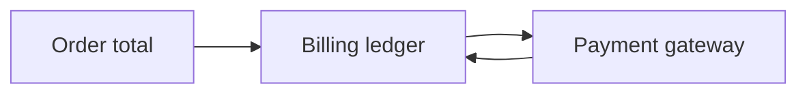
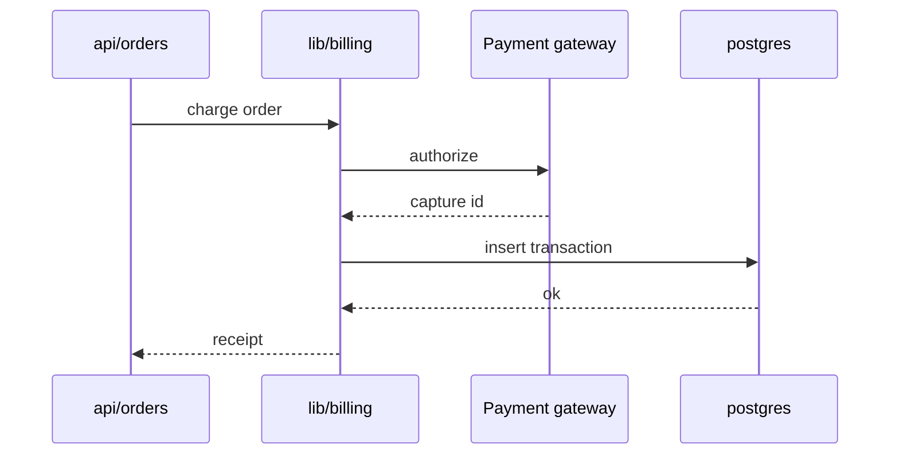

# Chapter 2: Billing

## Motivation

NexusHub must record every money movement exactly once. The concrete use case:
a shopper checks out a cart, the api asks the billing library to charge the
order total, and a transaction row is written to postgres so finance can
reconcile later. If billing is wrong, either customers are double-charged or
the platform loses money.

## Core idea

Billing is a ledger. Each charge is an append-only transaction row linked to
an order. The library never mutates a row after insert; it only adds new rows
for refunds or adjustments. Think of it as a paper receipt book: you write a
line, you never erase one.

## Mental model



## How to use it

The api calls the shared billing library to charge an order:

```rust
use shared::billing::charge_order;

let receipt = charge_order(&pool, order.id, order.total).await?;
```

The receipt contains the gateway capture id and the inserted transaction id.
Refunds use the same library:

```rust
use shared::billing::refund_order;

refund_order(&pool, receipt.transaction_id, amount).await?;
```

Both helpers live in `lib/billing/src/transaction.rs`.

## Under the hood

A charge is a sequence across four participants. The library authorizes with
the gateway, captures, then inserts the transaction row inside a transaction
so the ledger and gateway stay consistent.



## Key files

- `lib/billing/src/transaction.rs` — charge and refund entrypoints
- `lib/billing/src/ledger.rs` — ledger append and query helpers
- `lib/billing/src/gateway.rs` — payment gateway client wrapper
- `apps/api/src/billing/handlers.rs` — billing HTTP endpoints
- `apps/api/migrations/0003_transactions.sql` — transactions table schema

## Connections

- [Authentication](01_authentication.md) — charges are attributed to the
  authenticated user
- [Order Pipeline](03_order_pipeline.md) — the worker settles billing for
  each enqueued order
- [Architecture Overview](00_architecture_overview.md) — billing lives in
  the shared library

## Pitfalls

- Updating a transaction row in place. The ledger is append-only; refunds
  insert new rows rather than mutating the original charge.
- Calling the gateway outside the postgres transaction. If the insert fails
  after a capture, the platform holds a charge with no ledger entry.
- Reusing a capture id. Each charge gets a fresh capture id from
  `lib/billing/src/gateway.rs`; do not cache and replay one.

## Summary

Billing is an append-only ledger of transaction rows linked to orders. The
shared library wraps the payment gateway and writes rows inside a postgres
transaction. The final chapter shows how auth and billing compose into the
order pipeline: [Order Pipeline](03_order_pipeline.md).

## Evidence

Grounded in the listed paths. The charge sequence matches the implementation
in `lib/billing/src/transaction.rs` and the gateway client in
`lib/billing/src/gateway.rs`.
