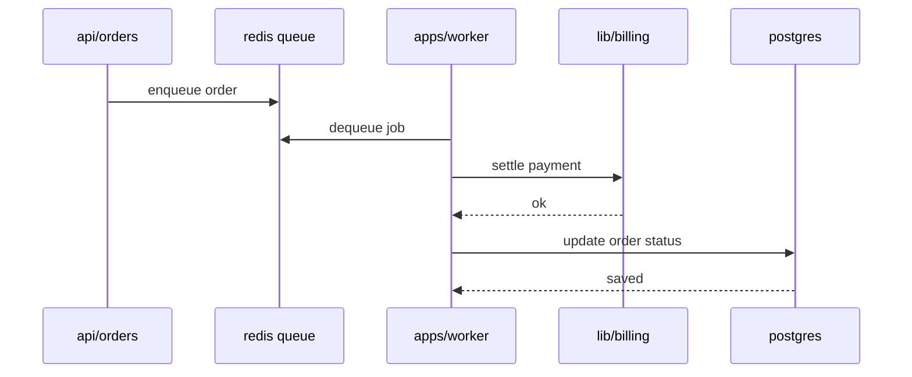

# Chapter 3: Order Pipeline

## Motivation

Checkout must be fast for the shopper but settlement involves slow external
calls. The concrete use case: a shopper clicks buy, the api creates an order
row and returns immediately, and the worker settles billing and updates the
order status in the background. Without this split, every checkout would
block on the payment gateway.

## Core idea

The order pipeline is a queue. The api writes an order and enqueues a job; the
worker drains the queue and drives the order through its states. Think of it
as a restaurant kitchen: the waiter drops a ticket, the cook works it when
ready, and the status board updates as each dish is plated.

## Mental model


## How to use it

The api creates an order and enqueues a job:

```rust
use shared::orders::create_order;

let order = create_order(&pool, cart, user.id).await?;
queue.enqueue("settle_order", order.id).await?;
```

The worker registers a handler in `apps/worker/src/jobs.rs`:

```rust
worker.register("settle_order", |job| async move {
    settle_order(&pool, job.order_id).await
});
```

Order status moves through the states declared in `lib/shared/src/orders.rs`:
`pending`, `settled`, `shipped`, `cancelled`.

## Under the hood

The pipeline fans out across five participants. The api enqueues, the worker
dequeues, settles billing, and persists the new status.



## Key files

- `apps/api/src/orders/handlers.rs` — order creation and HTTP endpoints
- `apps/worker/src/jobs.rs` — worker job registry and dispatch loop
- `lib/shared/src/orders.rs` — Order type and status enum
- `lib/billing/src/transaction.rs` — settlement entrypoint used by the worker
- `apps/api/migrations/0002_orders.sql` — orders table schema

## Connections

- [Authentication](01_authentication.md) — orders are owned by the
  authenticated user
- [Billing](02_billing.md) — the worker calls the billing library to settle
- [Architecture Overview](00_architecture_overview.md) — the pipeline is the
  api-to-worker collaboration shown in the system map

## Pitfalls

- Settling billing inside the api handler. That re-introduces the gateway
  latency the queue was meant to hide; always enqueue and let the worker
  settle.
- Dropping a job without a retry. The dispatch loop in
  `apps/worker/src/jobs.rs` retries failed jobs; do not bypass it with raw
  redis pops.
- Mutating order status outside the worker. Status transitions belong in the
  worker handlers so the state machine in `lib/shared/src/orders.rs` stays
  consistent.

## Summary

The order pipeline splits fast checkout from slow settlement. The api creates
an order and enqueues a job; the worker dequeues, settles billing, and
updates the order status. This composes the auth identity and billing ledger
from the previous chapters. If you want to revisit the system map, see the
[Architecture Overview](00_architecture_overview.md).

## Evidence

Grounded in the listed paths. The pipeline sequence matches the order
handlers in `apps/api/src/orders/handlers.rs` and the worker dispatch in
`apps/worker/src/jobs.rs`.
