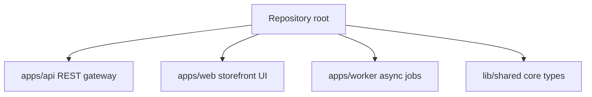
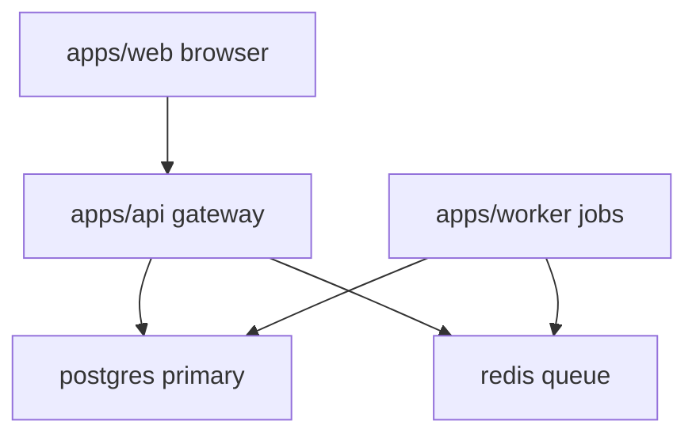
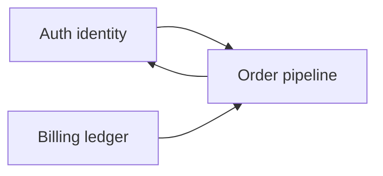
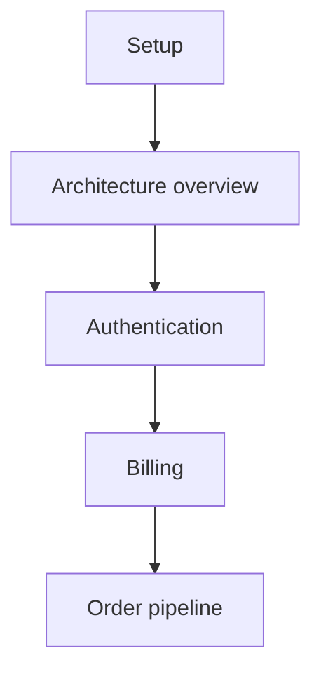

# NexusHub Tutorial Index

NexusHub is a fictional multi-app e-commerce monorepo. Three deployable
apps share one workspace: `apps/api` (REST gateway), `apps/web` (storefront
UI), and `apps/worker` (async jobs). This tutorial walks new engineers from
a clean checkout to a confident mental model of how orders flow end to end.

## How to use this tutorial

Read [Setup](00_setup.md) first so your machine can build and run the apps.
Then read [Architecture Overview](00_architecture_overview.md) for the system
map. After that, follow the learning path below in order: each concept chapter
assumes the previous one. Skim the mermaid diagrams before reading prose; they
are the fastest way to build a mental model. Every chapter ends with a Key
files section and an Evidence footer citing the real repo paths that back the
claims, so you can jump into the code at any point.

## Module inventory

NexusHub is carved into four workspace members. The root crate holds shared
tooling; each app under `apps/` is independently deployable.

## System map

The three apps collaborate over a postgres primary and a redis queue. The web
client talks only to the api; the worker consumes jobs enqueued by the api.

## Core concepts map

Three abstractions anchor the platform. Authentication establishes identity,
billing records money movement, and the order pipeline ties them together.

## Learning path

Chapters are ordered. Each one links to the next at the bottom of its page.

## Chapters

- [Setup](00_setup.md)
- [Architecture Overview](00_architecture_overview.md)
- [Authentication](01_authentication.md)
- [Billing](02_billing.md)
- [Order Pipeline](03_order_pipeline.md)

## Evidence

Paths cited above are from the repository inventory under `apps/` and `lib/`.
