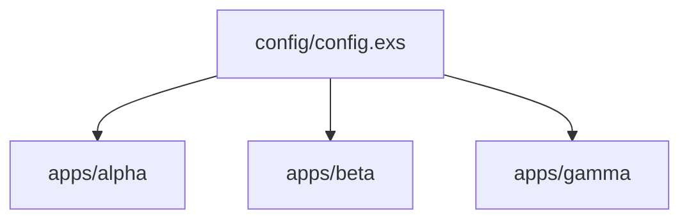

# Architecture Overview

The `umbrella` fixture is a minimal Elixir umbrella monorepo. One workspace
root declares three child applications under `apps/`, and a single config file
feeds all of them. This chapter describes the system type, how the monorepo is
carved up, how the apps relate at runtime, and the suggested reading order for
the concept chapters.

## System type

The fixture is an umbrella workspace: one root `mix.exs` sets `apps_path:
"apps"`, and each subdirectory under `apps/` is an independently versioned
Elixir application. There is no runtime coupling between the apps in this
fixture, each one exposes a single `hello/0` function. The umbrella layout is
chosen for deployment-boundary separation, not for domain splitting.

## App breakdown

The workspace is carved into three members:

- `apps/alpha` — first child application. Defines the `Alpha` module with
  `hello/0` returning `:alpha`. Declared in `apps/alpha/mix.exs`.
- `apps/beta` — second child application. Defines the `Beta` module with
  `hello/0` returning `:beta`. Declared in `apps/beta/mix.exs`.
- `apps/gamma` — third child application. Defines the `Gamma` module with
  `hello/0` returning `:gamma`. Declared in `apps/gamma/mix.exs`.

## Collaboration diagram

The three apps do not call each other. They share configuration sourced from
`config/config.exs`, which imports `Config` and sets a `key: :value` entry for
each application atom.

## Suggested reading order

1. [Umbrella Project Layout](01_umbrella_project_layout.md) — how the root
   workspace is declared
2. [Child Application Structure](02_child_application_structure.md) — what
   each `apps/*` member contains
3. [Shared Configuration](03_shared_configuration.md) — how config flows to
   all members
4. [Application Composition](04_application_composition.md) — how the apps
   compose in the workspace
5. [Environment and Secrets](05_environment_and_secrets.md) — env var handling

## Key files

- `mix.exs` — root umbrella project declaration with `apps_path: "apps"`
- `apps/alpha/mix.exs` — alpha application project definition
- `apps/beta/mix.exs` — beta application project definition
- `apps/gamma/mix.exs` — gamma application project definition
- `config/config.exs` — shared configuration for all three apps
- `README.md` — workspace overview and prerequisites

## Evidence

Grounded in the listed paths. The umbrella layout matches `apps_path: "apps"`
in the root `mix.exs` and the three `apps/*/mix.exs` declarations. Continue
with [Umbrella Project Layout](01_umbrella_project_layout.md).
