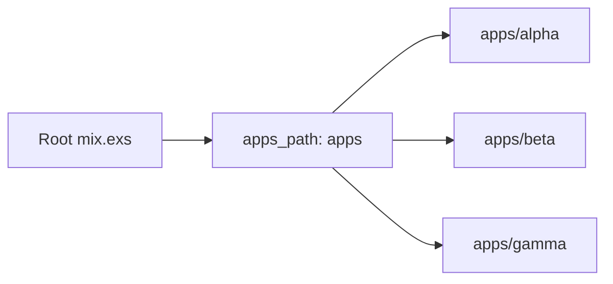
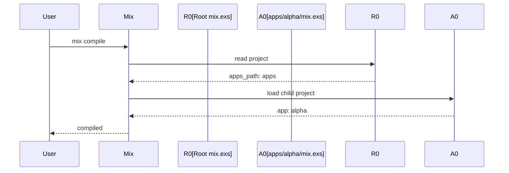

# Chapter 1: Umbrella Project Layout

## Motivation

A new engineer cloning the `umbrella` fixture needs to understand why the root
`mix.exs` looks different from a regular Elixir project. The concrete use case:
you run `mix deps.get` at the repository root and expect dependencies to be
fetched for all three child apps at once. Without understanding the umbrella
project layout, you might try to run `mix` inside each `apps/` subdirectory and
get confused by the missing dependency tree.

## Core idea

An umbrella project is a workspace, not an application. The root `mix.exs`
declares `apps_path: "apps"` instead of an `app:` key. Mix treats every
subdirectory under that path as a separate application with its own `mix.exs`.
Think of it as a shopping mall: the building itself is not a store, it is the
structure that houses the stores.

## Mental model



## How to use it

From the repository root, run any umbrella-aware Mix task:

```sh
mix deps.get
mix compile
mix phx.server
```

Each command recurses into the child applications declared under `apps/`. You
do not need to `cd` into `apps/alpha` to fetch its dependencies.

## Under the hood

The root project module is minimal. It returns a keyword list with `apps_path`,
`version`, and an empty `deps` list. Mix uses `apps_path` to discover child
projects.



## Key files

- `mix.exs` — root umbrella project with `apps_path: "apps"`
- `apps/alpha/mix.exs` — alpha child project declaration
- `apps/beta/mix.exs` — beta child project declaration
- `apps/gamma/mix.exs` — gamma child project declaration
- `README.md` — workspace prerequisites and umbrella layout notes

## Connections

- [Architecture Overview](00_architecture_overview.md) — where the umbrella
  root sits in the system map
- [Child Application Structure](02_child_application_structure.md) — what each
  `apps/*` member contains
- [Shared Configuration](03_shared_configuration.md) — config flows from the
  root into all children

## Pitfalls

- Adding an `app:` key to the root `mix.exs`. The root is a workspace, not a
  deployable application; mixing the two confuses Mix.
- Creating a child app outside `apps/`. Mix only scans the directory named by
  `apps_path`, so a sibling directory is invisible to the workspace.
- Declaring dependencies in the root `deps`. Umbrella deps belong in each
  child's `mix.exs`; the root `deps` list is for workspace tooling only.

## Summary

The umbrella root is a workspace declaration, not an application. It points Mix
at `apps/` and lets each child manage its own dependencies and version. The
next chapter looks inside a child application:
[Child Application Structure](02_child_application_structure.md).

## Evidence

Grounded in the listed paths. The umbrella declaration matches `apps_path:
"apps"` in the root `mix.exs` and the three child `mix.exs` files under
`apps/`.
