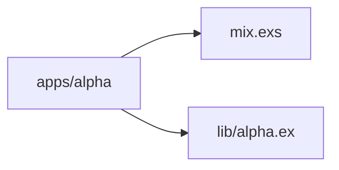
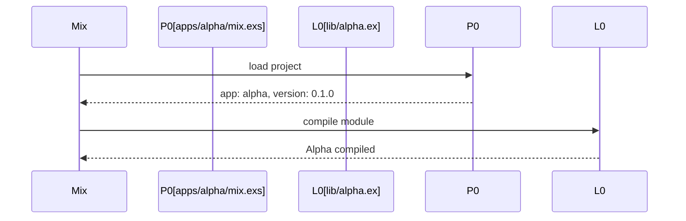

# Chapter 2: Child Application Structure

## Motivation

Each directory under `apps/` is a self-contained Elixir application. The
concrete use case: you want to add a feature to `apps/alpha` and need to know
where its source lives, how it is declared, and what its public API is.
Without understanding the child structure, you might edit the root `mix.exs`
expecting it to own the `Alpha` module.

## Core idea

A child application is a regular Mix project that happens to live under an
umbrella. It has its own `mix.exs` with an `app:` key, its own `lib/`
directory, and its own version. The umbrella only provides the workspace
boundary; the child owns its code. Think of it as a tenant in an apartment
building: the building provides the address, the apartment owns the furniture.

## Mental model



## How to use it

Inspect a child application from the root:

```sh
mix app.tree --app alpha
```

Or open its source directly. The `Alpha` module is defined in
`apps/alpha/lib/alpha.ex` and exposes one function:

```elixir
Alpha.hello()
```

## Under the hood

Each child follows the same three-part shape: a project module, a `lib/`
source tree, and a `mix.exs` manifest. The project module returns the `app`
atom, a version string, and a deps list.



## Key files

- `apps/alpha/mix.exs` — alpha project definition with `app: :alpha`
- `apps/alpha/lib/alpha.ex` — `Alpha` module defining `hello/0`
- `apps/beta/mix.exs` — beta project definition with `app: :beta`
- `apps/beta/lib/beta.ex` — `Beta` module defining `hello/0`
- `apps/gamma/mix.exs` — gamma project definition with `app: :gamma`
- `apps/gamma/lib/gamma.ex` — `Gamma` module defining `hello/0`

## Connections

- [Umbrella Project Layout](01_umbrella_project_layout.md) — how the root
  discovers these children
- [Shared Configuration](03_shared_configuration.md) — config is injected into
  each child by atom
- [Application Composition](04_application_composition.md) — how the children
  relate at runtime

## Pitfalls

- Putting source in the root `lib/`. Child source belongs in
  `apps/<name>/lib/`; the root has no `lib/` directory in this fixture.
- Reusing an `app:` atom across children. Each child must have a unique app
  atom, as seen in `apps/alpha/mix.exs`, `apps/beta/mix.exs`, and
  `apps/gamma/mix.exs`.
- Expecting children to share a version. Each child versions independently;
  the root `version: "0.1.0"` is the workspace version, not the app version.

## Summary

Each `apps/*` directory is a regular Mix project with its own `mix.exs`,
`lib/`, and version. The umbrella only groups them. The next chapter covers
how configuration reaches all children:
[Shared Configuration](03_shared_configuration.md).

## Evidence

Grounded in the listed paths. The child structure matches the `app:` keys in
each `apps/*/mix.exs` and the module definitions in `apps/*/lib/*.ex`.
