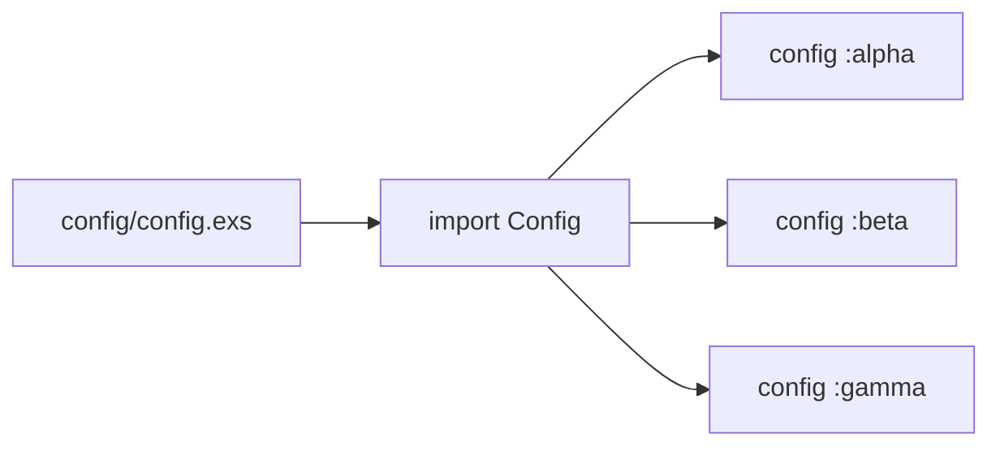

# Chapter 3: Shared Configuration

## Motivation

All three child applications read from one config file. The concrete use case:
you change a setting for `alpha` and want it to apply consistently without
editing three separate files. Without understanding the shared config model,
you might hunt for `config/dev.exs` inside each `apps/` directory and find
nothing.

## Core idea

Umbrella config lives at the root, in `config/config.exs`. It uses `import
Config` and calls `config :app_name, key: value` per application atom. Mix
loads this file for every child at compile and runtime. Think of it as a
central thermostat: one dial sets the temperature for every room in the
building.

## Mental model



## How to use it

Open `config/config.exs` to view or edit shared settings:

```elixir
import Config

config :alpha, key: :value
config :beta, key: :value
config :gamma, key: :value
```

Read a value at runtime from any child:

```elixir
Application.get_env(:alpha, :key)
```

## Under the hood

The config file is evaluated once and the resulting environment is merged into
the application environment for each atom. Each `config :<atom>, keyword`
call appends to that atom's environment.

```mermaid
sequenceDiagram
  participant M0 as Mix
  participant C0[config/config.exs]
  participant A0[:alpha env]
  participant B0[:beta env]
  M0->>C0: evaluate config
  C0->>A0: config :alpha, key: :value
  C0->>B0: config :beta, key: :value
  A0-->>M0: env merged
  B0-->>M0: env merged
```

## Key files

- `config/config.exs` — shared config for all three child apps
- `apps/alpha/mix.exs` — declares the `:alpha` atom the config targets
- `apps/beta/mix.exs` — declares the `:beta` atom the config targets
- `apps/gamma/mix.exs` — declares the `:gamma` atom the config targets
- `mix.exs` — root umbrella project that loads the config directory

## Connections

- [Child Application Structure](02_child_application_structure.md) — config
  targets the app atoms declared here
- [Environment and Secrets](05_environment_and_secrets.md) — runtime secrets
  complement the compile-time config
- [Architecture Overview](00_architecture_overview.md) — config is the shared
  spine in the system map

## Pitfalls

- Creating per-child `config/` directories. Umbrella config is centralized at
  the root; child-level config files are ignored unless explicitly imported.
- Using a runtime config file without `config/runtime.exs`. The fixture only
  ships `config/config.exs`, which is compile-time.
- Mismatching the atom. `config :alpa, key: :value` would silently target a
  non-existent app; always match the `app:` key in the child `mix.exs`.

## Summary

Shared config lives in `config/config.exs` and feeds all three child apps by
atom. One file, three environments. The next chapter shows how the apps
compose inside the workspace:
[Application Composition](04_application_composition.md).

## Evidence

Grounded in the listed paths. The config entries match the `app:` atoms in
each `apps/*/mix.exs` and the `import Config` call in `config/config.exs`.
