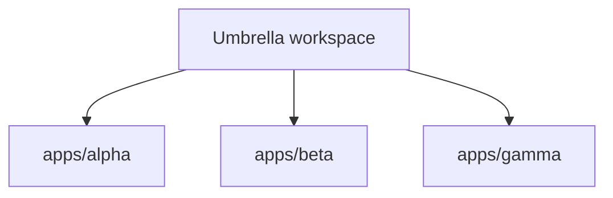
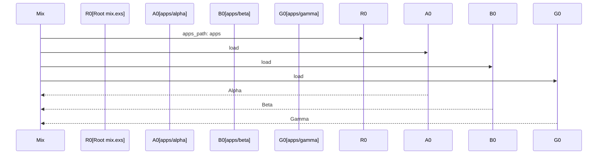

# Chapter 4: Application Composition

## Motivation

The three child apps do not call each other in this fixture, but they still
compose as workspace members. The concrete use case: you run `mix phx.server`
from the root and expect all applications to start together. Without
understanding composition, you might wonder why `alpha`, `beta`, and `gamma`
boot as part of the same release even though no code references them.

## Core idea

Composition in an umbrella is about co-location, not invocation. The child
apps share a build, a dependency fetch, and a config namespace. They are
composed by the workspace, not by function calls. Think of it as a book of
short stories: each story stands alone, but they share one binding and one
table of contents.

## Mental model



## How to use it

List all applications in the workspace:

```sh
mix deps
```

Start a release that includes all children:

```sh
mix phx.server
```

Each child's `hello/0` is reachable from the root shell:

```elixir
Alpha.hello()
Beta.hello()
Gamma.hello()
```

## Under the hood

Composition happens at the Mix project level. The root `mix.exs` declares
`apps_path: "apps"`, and Mix loads every child project it finds there. There
are no explicit `deps: [{:alpha, in_umbrella: true}]` edges in this fixture
because the children do not depend on each other.



## Key files

- `mix.exs` — root umbrella project declaring `apps_path: "apps"`
- `apps/alpha/lib/alpha.ex` — `Alpha.hello/0` returning `:alpha`
- `apps/beta/lib/beta.ex` — `Beta.hello/0` returning `:beta`
- `apps/gamma/lib/gamma.ex` — `Gamma.hello/0` returning `:gamma`
- `config/config.exs` — shared config consumed by all three

## Connections

- [Umbrella Project Layout](01_umbrella_project_layout.md) — the root that
  composes the children
- [Child Application Structure](02_child_application_structure.md) — the
  members being composed
- [Shared Configuration](03_shared_configuration.md) — the config spine shared
  during composition

## Pitfalls

- Assuming children import each other. In this fixture there are no
  `in_umbrella: true` deps; each child is standalone.
- Starting one child in isolation from the root. Use `mix run --app alpha` if
  you need a single-app shell, not a bare `iex`.
- Forgetting that composition is build-time. The children share a compile and
  dep fetch, but runtime startup still follows each app's `start/2` callback.

## Summary

The three children compose by co-location under one umbrella. They share a
build and config namespace but do not call each other. The final chapter
covers environment variables and secrets:
[Environment and Secrets](05_environment_and_secrets.md).

## Evidence

Grounded in the listed paths. The composition model matches `apps_path: "apps"`
in the root `mix.exs` and the absence of cross-child deps in each
`apps/*/mix.exs`.
