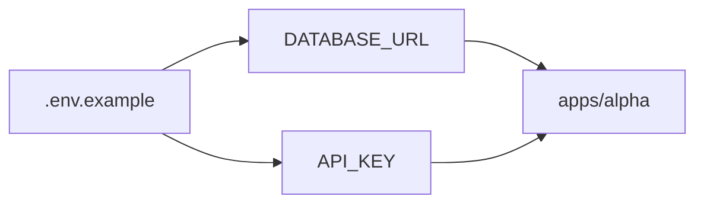
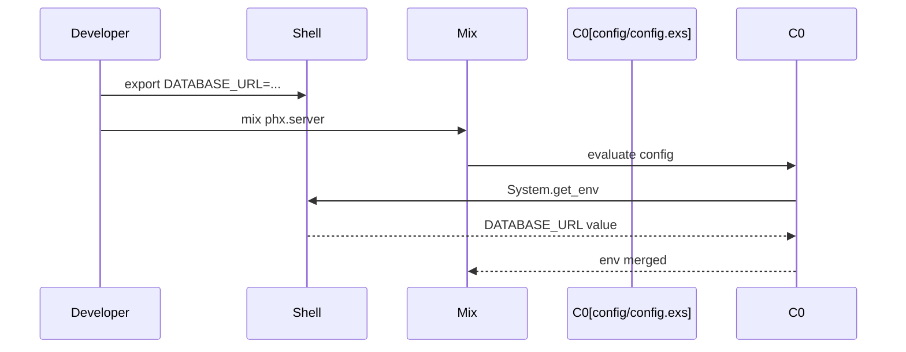

# Chapter 5: Environment and Secrets

## Motivation

The fixture ships a `.env.example` template that declares runtime secrets. The
concrete use case: you clone the repo, copy `.env.example` to `.env`, and fill
in `DATABASE_URL` and `API_KEY` before running the apps. Without understanding
the env contract, you might hardcode secrets into `config/config.exs` and
accidentally commit them.

## Core idea

Secrets live in environment variables, not in source. The `.env.example` file
is a template that documents which variables are required. At runtime, each
child reads its secrets through `System.get_env/1` or `Application.get_env/2`
after the env is loaded. Think of it as a lockbox: the example shows the shape
of the key, but the real key stays outside the repo.

## Mental model



## How to use it

Copy the template and fill in local values:

```sh
cp .env.example .env
```

The template declares:

```text
DATABASE_URL=ecto://postgres@localhost/umbrella_dev
API_KEY=replace-me
```

Read a secret at runtime from any child:

```elixir
System.get_env("DATABASE_URL")
```

## Under the hood

The `.env.example` file is not loaded by Mix directly; it is a documentation
artifact for developers. A tool like `dotenv` or the shell exports the
variables before `mix` runs. The config file can then bridge env into the
application environment.



## Key files

- `.env.example` — template declaring `DATABASE_URL` and `API_KEY`
- `config/config.exs` — shared config that can bridge env vars into app env
- `mix.exs` — root umbrella project loaded after env is set
- `apps/alpha/mix.exs` — alpha child that consumes the configured environment
- `apps/beta/mix.exs` — beta child that consumes the configured environment
- `apps/gamma/mix.exs` — gamma child that consumes the configured environment

## Connections

- [Shared Configuration](03_shared_configuration.md) — env vars complement the
  compile-time config
- [Architecture Overview](00_architecture_overview.md) — env is one of the two
  shared spines in the system map
- [Application Composition](04_application_composition.md) — all children
  consume the same env contract

## Pitfalls

- Committing a real `.env` file. The repo only ships `.env.example`; never
  copy real secrets into a tracked file.
- Reading secrets directly in modules instead of through `Application.get_env`.
  Centralize env access in config so secrets are testable and overridable.
- Assuming `.env.example` is auto-loaded. It is a template; the shell or a
  dotenv loader must export the variables before Mix runs.

## Summary

Secrets are declared in `.env.example` and loaded at runtime through the
shell, not hardcoded in source. The config file bridges env vars into the
application environment for all three children. To revisit the system map, see
the [Architecture Overview](00_architecture_overview.md).

## Evidence

Grounded in the listed paths. The env contract matches the variables declared
in `.env.example` and the config consumption pattern in `config/config.exs`.
