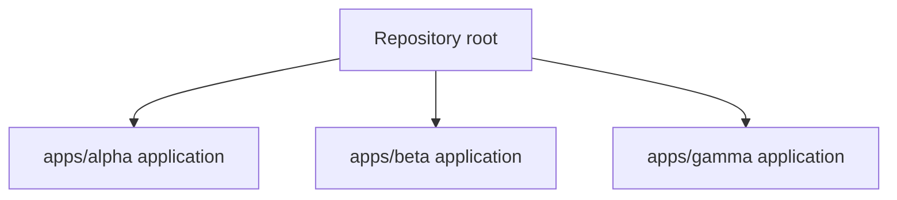
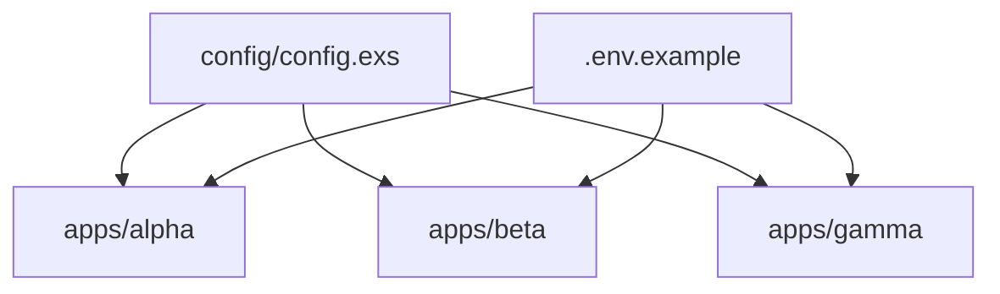
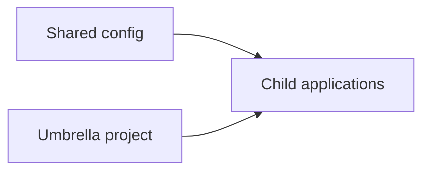
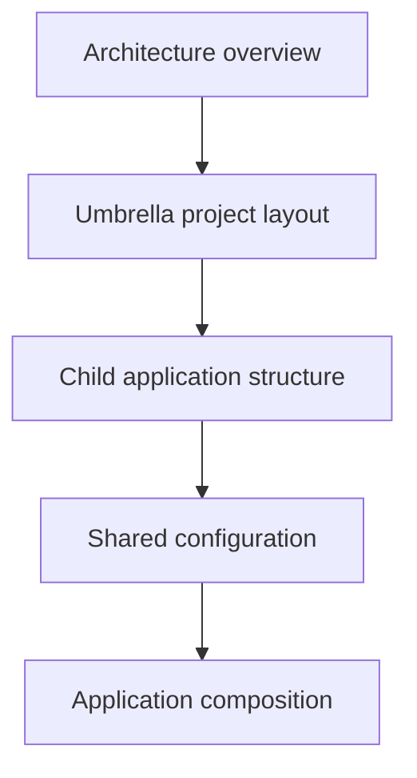

# Umbrella Workspace Tutorial Index

The `umbrella` fixture is a tiny Elixir-style umbrella monorepo. Three small
applications share one workspace root and a single config file. This tutorial
walks a new engineer from a clean checkout to a confident mental model of how
the apps are laid out, how they share configuration, and how they compose at
runtime.

## How to use this tutorial

Read [Architecture Overview](00_architecture_overview.md) first for the system
map. After that, follow the learning path below in order: each concept chapter
assumes the previous one. Skim the mermaid diagrams before reading prose; they
are the fastest way to build a mental model. Every chapter ends with a Key
files section and an Evidence footer citing the real repo paths that back the
claims, so you can jump into the code at any point.

## Module inventory

The workspace is carved into three application members under `apps/`. The root
holds shared tooling and configuration.

## System map

The three apps are independent siblings. They do not call each other directly;
they share configuration sourced from `config/config.exs` and environment
variables declared in `.env.example`.

## Core concepts map

Three abstractions anchor the workspace. The umbrella project defines the
workspace boundary, each child app is an independently versioned member, and
shared config feeds all members from one source.

## Learning path

Chapters are ordered. Each one links to the next at the bottom of its page.

## Chapters

- [Architecture Overview](00_architecture_overview.md)
- [Umbrella Project Layout](01_umbrella_project_layout.md)
- [Child Application Structure](02_child_application_structure.md)
- [Shared Configuration](03_shared_configuration.md)
- [Application Composition](04_application_composition.md)
- [Environment and Secrets](05_environment_and_secrets.md)

## Evidence

Paths cited above are from the repository inventory under `apps/`, `config/`,
and the root `mix.exs`.
